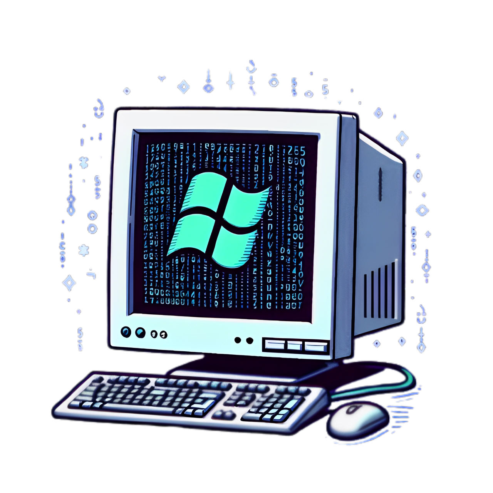

# Layl Shell

Welcome to the Layl Shell, a shell and script interperter for Microsoft Windows

## How To Get The Executable

To get the beta version, compile the source in the dev branch of the repository
to get the stable version, check [releases](https://github.com/winrevive/layl-shell/releases)

## How To Use

 - To enter the shell, run the executable.
 - To use the interperter, either go to the commandline and start ``layl your\path\to\your-file-name.lys`` or enter the shell and type ``.\your-file-name.lys`` or ``{path\to\your-file-name.lys}``.

## Layl Shell/Script Interpreter Documentation

[Docs Are Located Here](docs/contents.md)

© WinRevive 2024, All Rights Reserved.
